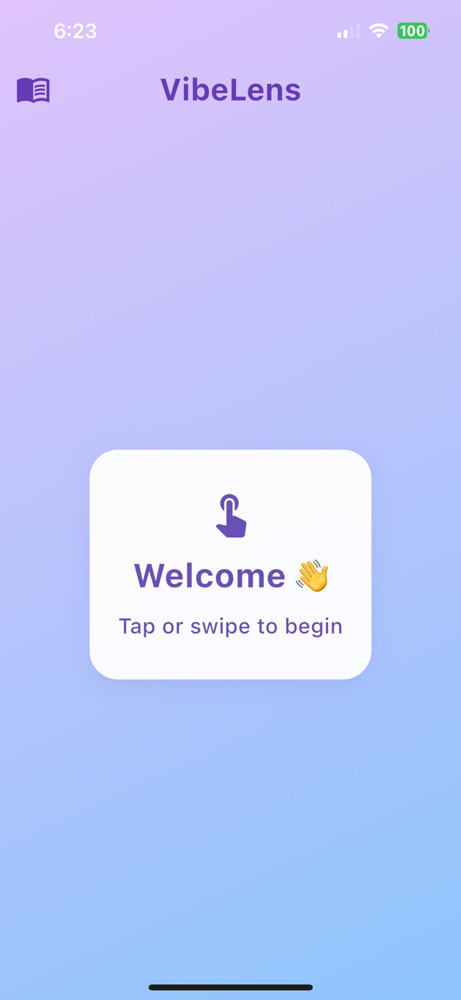
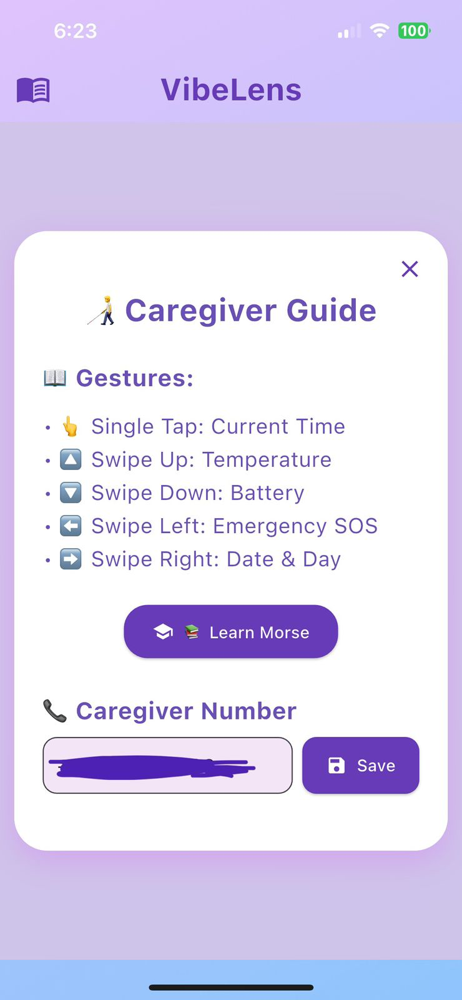
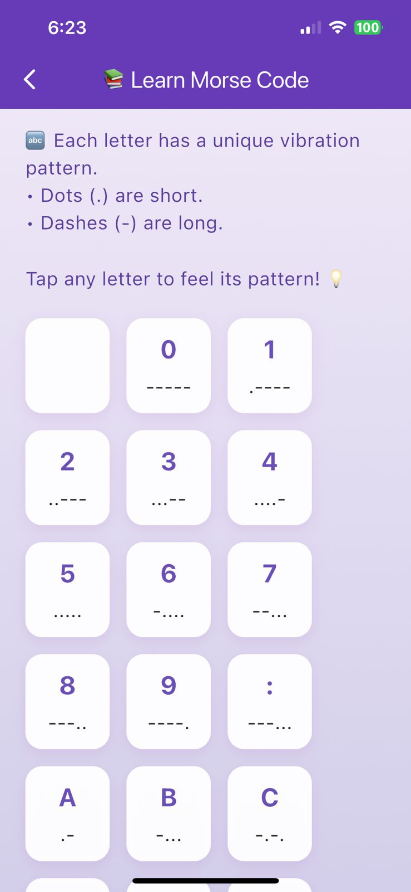
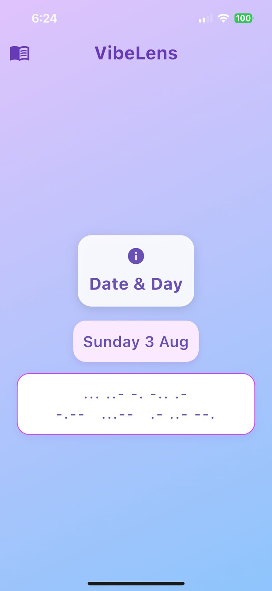
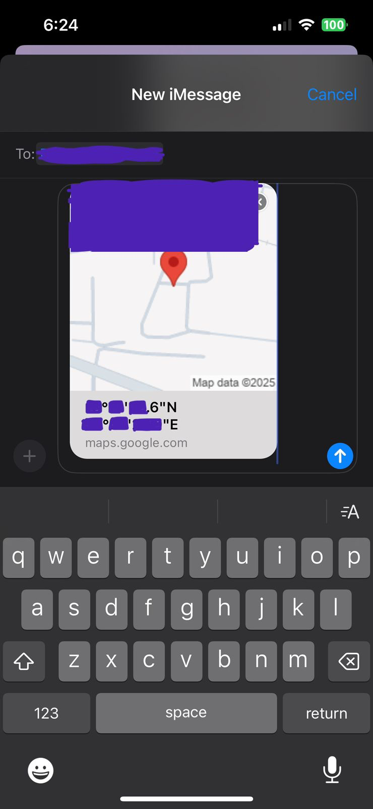
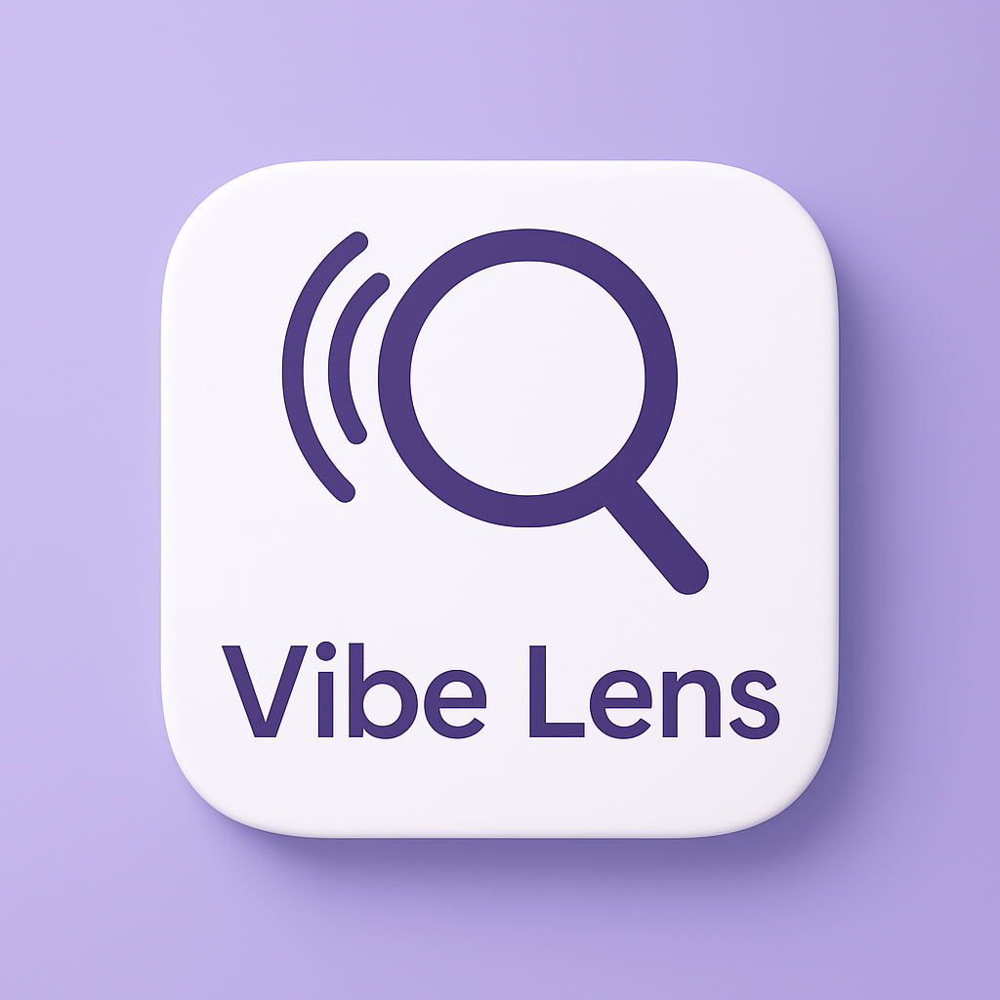

# 📱 Vibe Lens – A Touch-Based Assistant for Deaf-Blind Users

Vibe Lens is an inclusive Flutter app designed to empower individuals who are both **deaf and blind** by converting essential information into **Morse-code vibrations** triggered by simple **gestures**. It requires no visual or auditory input—just **touch**.

> 🧭 Aiming to redefine accessibility through haptic feedback, Vibe Lens serves as a **vibrating communicator** for time, weather, battery, and emergencies.

---

## 🎥 Live Demo

Watch the full demo on YouTube:  
👉 [Vibe Lens – Accessibility in Action](https://www.youtube.com/watch?v=your_video_id_here)

---

## 📸 App Screenshots

### 🖼️ Main Screen


> The minimalistic home interface responds to tap and swipe gestures and communicates using vibration patterns. The UI remains distraction-free to prioritize accessibility.

---

### 🧑‍🦯 Caregiver Guide


> A visual guide for caregivers explaining all supported gestures and their meanings. It also allows saving a caregiver's contact number and provides quick access to the Morse teacher.

---

### 📚 Morse Teacher


> Learn vibration patterns of all alphabets in Morse code. Each card shows the character and its corresponding code for better memory retention and learning.

---

### 📳 Vibration in Action



> Demonstrates the app vibrating a message (like time or SOS) using haptic feedback. This is how users **feel the world**, one dot and dash at a time.

---

## ✋ Supported Gestures

- 👆 **Single Tap** – Vibrates current time  
- 🔼 **Swipe Up** – Communicates current temperature  
- 🔽 **Swipe Down** – Indicates battery level  
- ⬅️ **Swipe Left** – Sends SOS via vibration  
- ➡️ **Swipe Right** – Vibrates current date and day  

---

## 🛠️ Tech Stack

- **Flutter** (Dart)
- **GestureDetector** for interaction
- **Vibration/Haptic Feedback APIs**
- **SharedPreferences** for local storage
- Clean, modular architecture using multiple packages

---

## 🧪 How to Run Locally

1. Clone the repo  
   ```bash
   git clone https://github.com/Karishma957/vibe-lens.git
   cd vibe-lens
   ```
2. Get packages  
   ```bash
   flutter pub get
   ```
3. Run on device/emulator  
   ```bash
   flutter run
   ```

> Make sure your device has vibration support enabled.

---

## 📱 App Icon



---

## 💡 Why Vibe Lens?

- ✨ Truly inclusive: no screen reading required  
- 👨‍👩‍👦 Caregiver-friendly  
- 🔐 Private: no internet access or tracking  
- 💖 Built with empathy and real-life application in mind

---

## 📬 Feedback & Contributions

Have an idea to improve this app?  
Open an issue or submit a pull request — we welcome all contributions!

---
